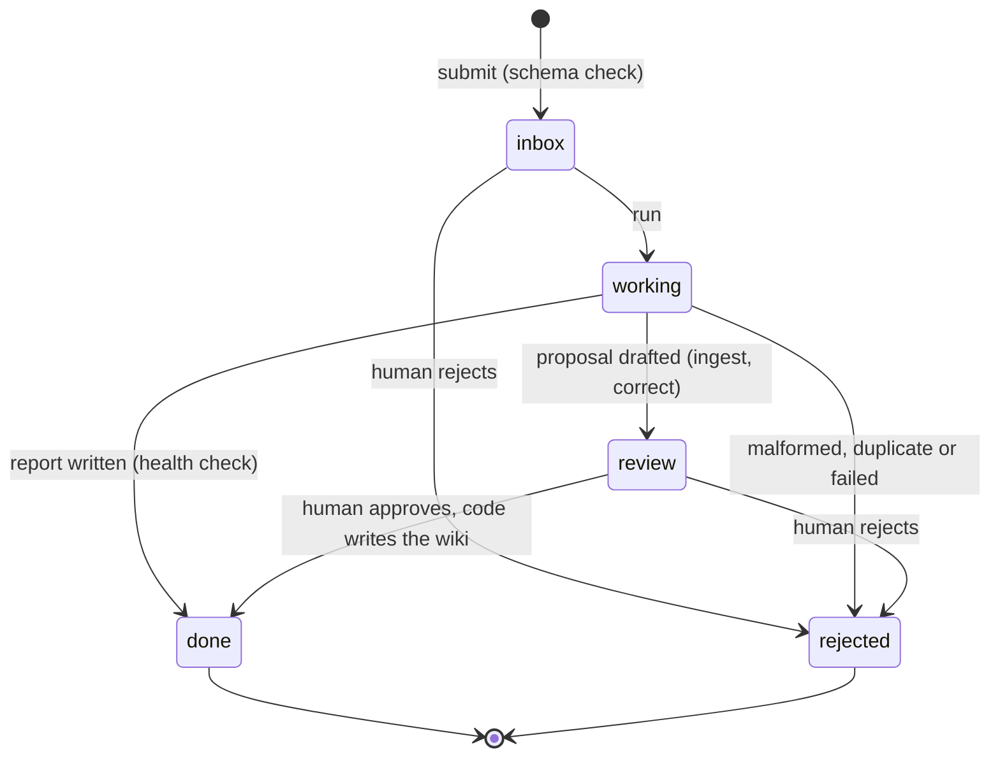
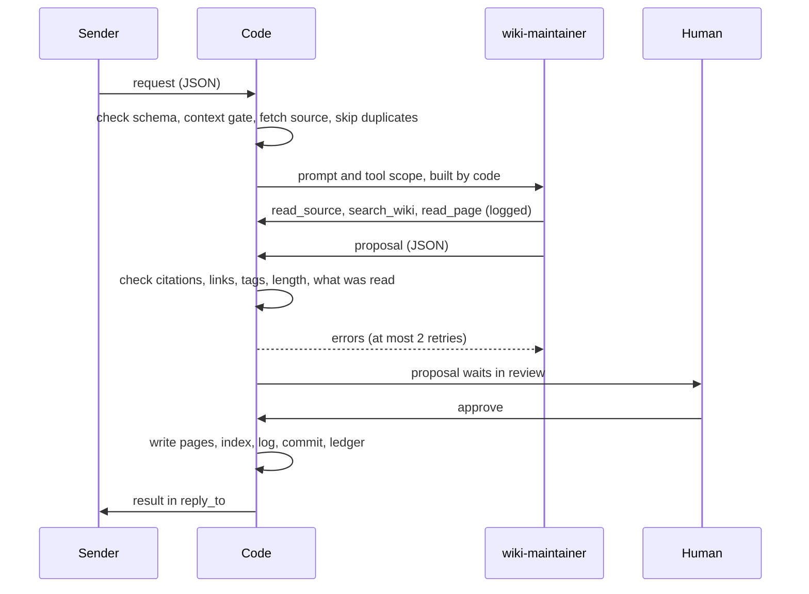

# Intake: diagrams

Back to [the factory](../../docs/factory.md).

## The belt

```mermaid
stateDiagram-v2
    [*] --> inbox: submit (schema check)
    inbox --> working: run
    inbox --> rejected: human rejects
    working --> rejected: malformed, duplicate or failed
    working --> review: proposal drafted (ingest, correct)
    working --> done: report written (health check)
    review --> done: human approves, code writes the wiki
    review --> rejected: human rejects
    done --> [*]
    rejected --> [*]
```

## Intake: who does what in one ingest

```mermaid
sequenceDiagram
    participant S as Sender
    participant C as Code
    participant A as wiki-maintainer
    participant H as Human
    S->>C: request (JSON)
    C->>C: check schema, context gate, fetch source, skip duplicates
    C->>A: prompt and tool scope, built by code
    A->>C: read_source, search_wiki, read_page (logged)
    A->>C: proposal (JSON)
    C->>C: check citations, links, tags, length, what was read
    C-->>A: errors (at most 2 retries)
    C->>H: proposal waits in review
    H->>C: approve
    C->>C: write pages, index, log, commit, ledger
    C->>S: result in reply_to
```
