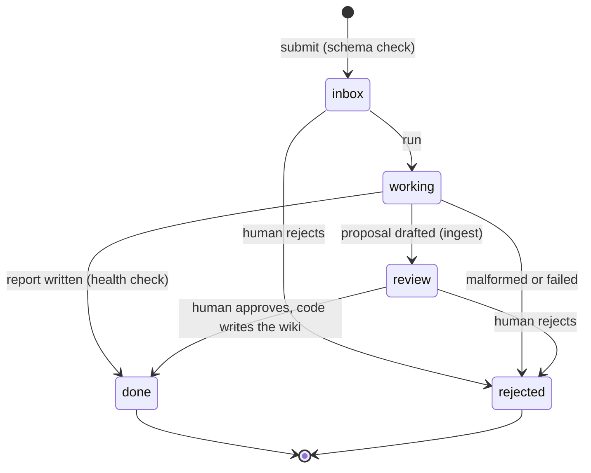

# Intake: diagrams

Back to [the factory](../../docs/factory.md).

## The belt

```mermaid
stateDiagram-v2
    [*] --> inbox: submit (schema check)
    inbox --> working: run
    inbox --> rejected: human rejects
    working --> rejected: malformed or failed
    working --> review: proposal drafted (ingest)
    working --> done: report written (health check)
    review --> done: human approves, code writes the wiki
    review --> rejected: human rejects
    done --> [*]
    rejected --> [*]
```
